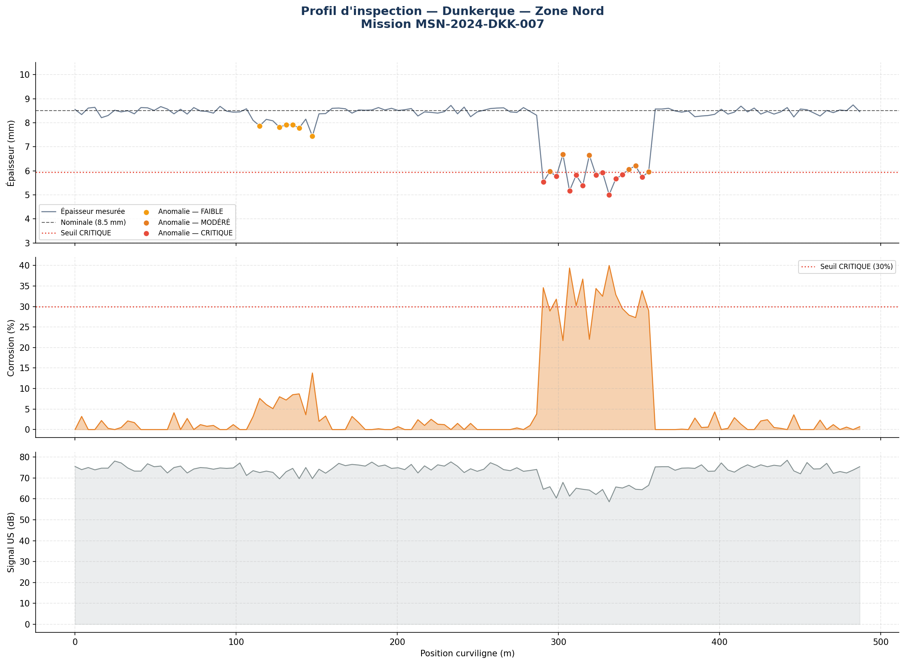
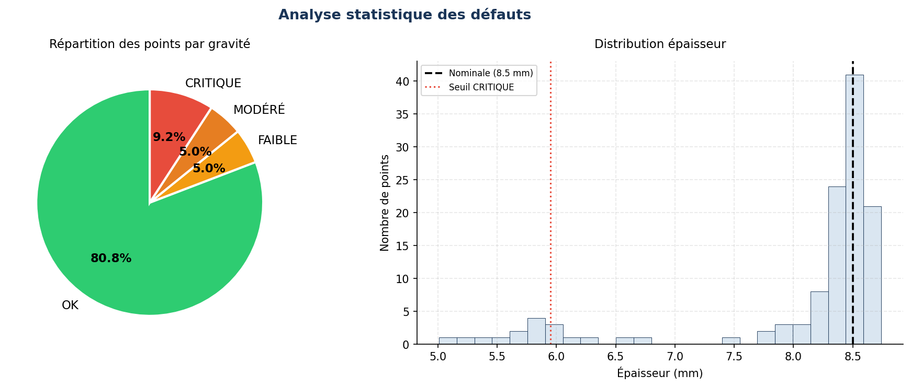
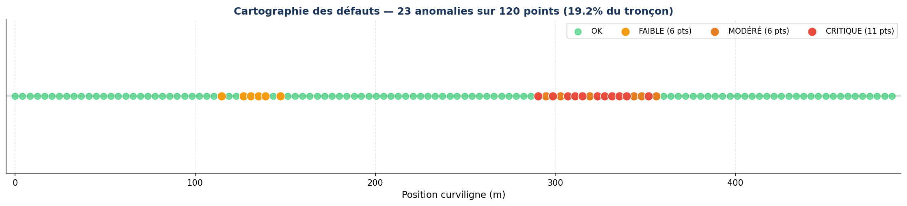

# 🤖 Pathfinder Inspection Analysis Pipeline

**Pipeline d'analyse automatique de missions d'inspection de canalisations**

> Projet Data Analyst — Inspiré des activités d'[Acwa Robotics](https://www.acwa-robotics.com)

---

## 📄 Rapport HTML interactif

Le pipeline génère un rapport HTML complet, consultable directement dans le navigateur.

**Pour l'ouvrir :**
1. Télécharger le fichier [`outputs/rapport_MSN-2024-DKK-007.html`](outputs/rapport_MSN-2024-DKK-007.html)
2. Double-cliquer dessus — il s'ouvre automatiquement dans votre navigateur

Un aperçu du rapport est disponible ici : [`outputs/rapport_MSN-2024-DKK-007.txt`](outputs/rapport_MSN-2024-DKK-007.txt)

---

## 📊 Aperçu des visualisations







---

## Contexte

Acwa Robotics développe le robot **Pathfinder**, qui circule à l'intérieur des canalisations d'eau potable pour en inspecter l'état structural.
À chaque mission, le robot collecte des données issues de plusieurs capteurs embarqués :
- 📡 **Capteur ultrasons** → épaisseur de paroi, taux de corrosion
- 📍 **GPS / encodeur odométrique** → position curviligne
- 🌡️ **Sondes physiques** → température, pression hydraulique

Ce projet simule le workflow complet d'un **Data Analyst** traitant ces données brutes et produisant un rapport d'analyse structuré à destination des équipes techniques et des clients (collectivités, industriels).

---

## Structure du projet

```
pathfinder-analysis-v2/
│
├── 📓 notebooks/
│   └── analyse_pathfinder.ipynb        ← Notebook principal (workflow complet)
│
├── 📂 data/
│   └── mission_sample.csv              ← Données brutes simulées (120 mesures)
│
├── 📂 src/
│   ├── generate_data.py                ← Script de génération du dataset
│   └── generate_report.py             ← Script de génération du rapport HTML
│
├── 📂 outputs/                         ← Graphiques et exports générés
│   ├── rapport_MSN-2024-DKK-007.html  ← Rapport interactif (à télécharger)
│   ├── rapport_MSN-2024-DKK-007.txt   ← Synthèse texte
│   ├── mission_analysee_MSN-2024-DKK-007.csv
│   ├── chart_profil_inspection.png
│   ├── chart_statistiques.png
│   ├── chart_cartographie.png
│   ├── eda_distributions.png
│   ├── eda_correlation.png
│   └── detection_zscore.png
│
├── requirements.txt
├── .gitignore
└── README.md
```

---

## Workflow du notebook

```
CSV brut (données capteurs)
         │
         ▼
  ⚙️  Étape 0 — Configuration & imports
         │
         ▼
  📥  Étape 1 — Chargement & validation
         │         (types, valeurs manquantes, plages physiques)
         ▼
  🔍  Étape 2 — EDA
         │         (distributions, corrélations)
         ▼
  🚨  Étape 3 — Détection d'anomalies
         │         (z-score + seuils métier)
         ▼
  🏷️  Étape 4 — Classification gravité
         │         (OK / FAIBLE / MODÉRÉ / CRITIQUE)
         ▼
  📊  Étape 5 — Visualisations
         │         (profil d'inspection, cartographie, stats)
         ▼
  💾  Étape 6 — Export
                  (CSV enrichi + rapport HTML + rapport texte)
```

---

## Méthode de détection d'anomalies

Deux critères sont combinés en **union logique** :

### 1. Z-score statistique
```
z = (épaisseur - μ) / σ
```
Un point est anormal si `z < -2.0` (dans le 2.5% inférieur de la distribution).

### 2. Seuils métier (perte d'épaisseur)

| Niveau       | Perte d'épaisseur | Action recommandée                        |
|--------------|-------------------|-------------------------------------------|
| ✅ OK        | < 5 %             | Aucune action                             |
| 🟡 FAIBLE    | 5 – 15 %          | Surveillance — ré-inspection dans 6 mois  |
| 🟠 MODÉRÉ    | 15 – 30 %         | Inspection complémentaire + planification |
| 🔴 CRITIQUE  | > 30 %            | Intervention urgente                      |

---

## Résultats sur la mission simulée (MSN-2024-DKK-007)

| Indicateur | Valeur |
|---|---|
| Longueur inspectée | 487 m |
| Points de mesure | 120 |
| Anomalies détectées | 25 (20.8%) |
| Points CRITIQUES | 11 |
| Épaisseur minimale | ~5.0 mm (perte 41%) |
| Corrosion maximale | 40% |

**2 zones dégradées identifiées :**
- Zone 1 : 110–150 m → dégradation légère (FAIBLE)
- Zone 2 : 290–360 m → dégradation sévère (CRITIQUE)

---

## Installation & exécution

```bash
# 1. Cloner le dépôt
git clone https://github.com/igorlam00237/pathfinder-analysis-v2
cd pathfinder-analysis-v2

# 2. Installer les dépendances
pip install -r requirements.txt

# 3. Générer les données simulées
python src/generate_data.py

# 4. Générer le rapport HTML
python src/generate_report.py

# 5. Lancer Jupyter et ouvrir le notebook
jupyter notebook notebooks/analyse_pathfinder.ipynb
```

---

## Stack technique

| Librairie | Version | Usage |
|-----------|---------|-------|
| Python | 3.10+ | Langage principal |
| Pandas | ≥ 2.0 | Manipulation des données |
| NumPy | ≥ 1.24 | Calculs statistiques |
| Matplotlib | ≥ 3.7 | Visualisations |
| Jupyter | ≥ 1.0 | Environnement notebook |

---

## Variables du dataset

| Variable | Type | Unité | Source capteur |
|---|---|---|---|
| `timestamp` | datetime | – | Horloge embarquée |
| `position_m` | float | m | Encodeur odométrique |
| `x_gps`, `y_gps` | float | ° | GPS/INS |
| `epaisseur_mm` | float | mm | Capteur ultrasons |
| `corrosion_pct` | float | % | Capteur ultrasons |
| `signal_us_db` | float | dB | Transducteur US |
| `confiance_pct` | float | % | Algorithme embarqué |
| `temp_eau_c` | float | °C | Sonde thermique |
| `pression_bar` | float | bar | Capteur pression |
| `vitesse_cmps` | float | cm/s | Encodeur moteur |
| `frame_id` | string | – | Caméra HD |

---

*Igor LAMINSI — Data Scientist / Data Analyst*
[LinkedIn](https://linkedin.com/in/igor-laminsi) · [GitHub](https://github.com/igorlam00237)
